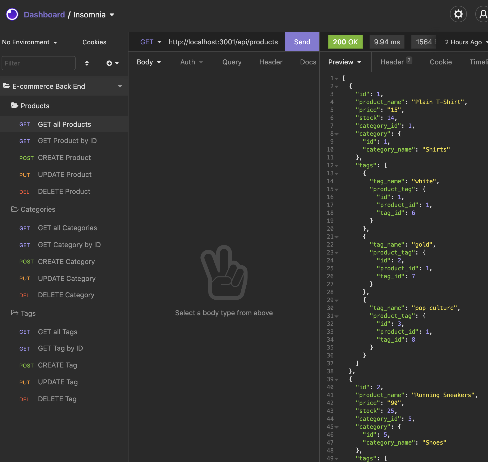

# E-Commerce Back End

## Description
The back end for an e-commerce site that takes a working Express.js API and configures to use Sequelize to interact with a MySQL database.

## Installation
- npm init
- npm install mysql2
- npm install sequelize
- npm install dotenv

## Usage
In your command line:
- For database connection 
    ```
    mysql -u root -p

    SOURCE schema.sql

    npm run seed
- To start the server & run the app
    ```
    node server.js


## Screenshot


## Demo Video
https://drive.google.com/file/d/1pP55NSGYHXfE8AmiZ1gzUUgwnhTNA6Vl/view?usp=sharing
